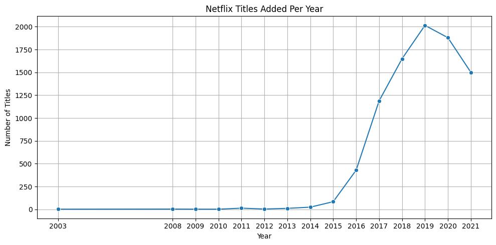
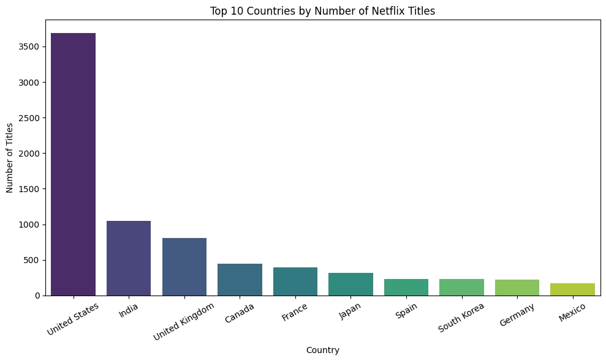
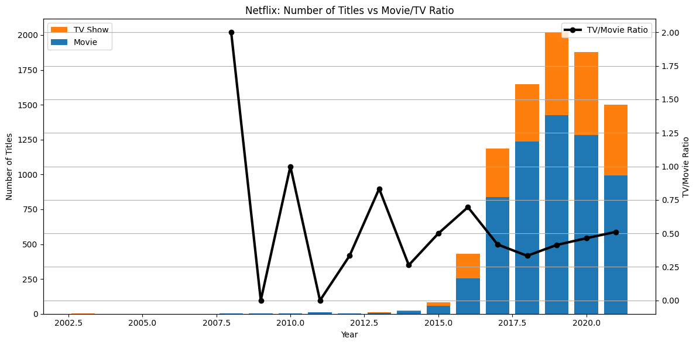
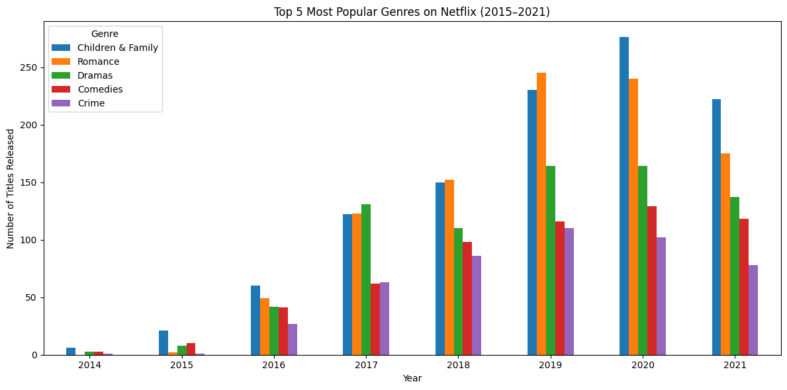
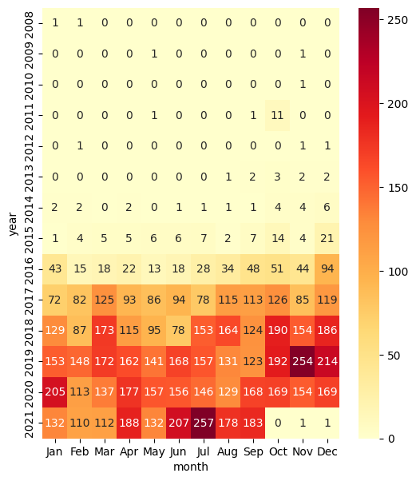
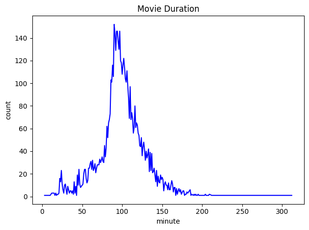

# Netflix-EDA-Project

## 📊 Netflix Content Strategy — Exploratory Data Analysis (EDA)

This project explores Netflix's public dataset to uncover trends in content production and distribution.  
Through Python-based exploratory data analysis (EDA), I analyzed growth trends, content types, genres, and release patterns.

## 🎯 Project Objectives
- Understand the growth trend and origin distribution of Netflix content
- Compare Movies vs TV Shows: ratio, trends, and duration
- Identify the most common genres and whether they differ between Movies and TV Shows
- Analyze release seasonality: are there holiday/summer peaks?
- Investigate the duration patterns for both Movies and TV Shows

## 📊 Key Findings & Visualizations
1. Netflix content grew rapidly from 2015 to 2019, with a noticeable drop in 2020 likely due to COVID-19 disruptions.
2. Movies dominate the library (~70%), but TV Shows have gradually increased since 2018.
3. Top genres: Children & Family, Romance, Dramas, Comedies, Crime.
4. Seasonal peaks are observed in summer and winter, aligning with global holiday seasons.
5. Most movies last 80–120 mins, while most TV Shows are single-season series.

Below are selected visualizations from the project.  
They summarize the main insights of Netflix content trends, type comparison, genre patterns, and duration analysis.

---

### 1️⃣ Annual Trend of Netflix Content (Q1)
*Number of new titles added by year*

---

### 2️⃣ Top Countries by Number of Titles (Q2)
*Shows the countries with the largest Netflix content libraries*

---

### 3️⃣ Movies vs TV Shows Trend (Q3)
*Stacked columns for yearly counts and a line for the Movies/TV ratio*

---

### 4️⃣ Top 5 Genres Trend (2015–2021) (Q4)
*Popularity trend of top 5 genres across years*

---

### 5️⃣ Monthly Release Heatmap (Q5)
*Highlights seasonal peaks and yearly patterns in content release*

---

### 6️⃣ Movie Duration Distribution (Q6)
*Distribution of movie lengths (minutes)*

---

Additional visualizations are available in the [`figures/`](figures) folder.

## 🛠️ Tools & Skills
- Python, Pandas, NumPy
- Data Cleaning & Transformation
- Matplotlib & Seaborn Visualization
- Exploratory Data Analysis (EDA) & Storytelling
   
## 📂 Project Structure
- `notebooks/Netflix_EDA_Project.ipynb`: Full analysis workflow
- `figures/`: Selected visualizations for quick review
- `data/`: Dataset or description
- `requirements.txt`: Key Python dependencies

🔍 Questions Answered

1.What's the trend of the number of contents published by Netflix? (Is there a increase?)

2.Which country/region has the largest number of contents?

3.What's the ratio of movies to TV series? Any change in the trend?

4.What are the most popular genres?

5.In which months does Netflix publish the largest number of new contents? Is there a holiday peak?

6.What's the distribution of the length of contents? (Short or long ?)

🔗***View Interactive Notebook on Colab**  
[Open in Google Colab](https://colab.research.google.com/drive/1u6q6fKyv2r6cZd5_aQIyLI0AqPo_9MYQ?usp=sharing)

✨ Author
[Lingjiang Ji]
Aspiring Data Analyst | Python & SQL & PowerBI | Focused on storytelling through data

| 🌐 [www.linkedin.com/in/lingjiang-ji-417122360]
